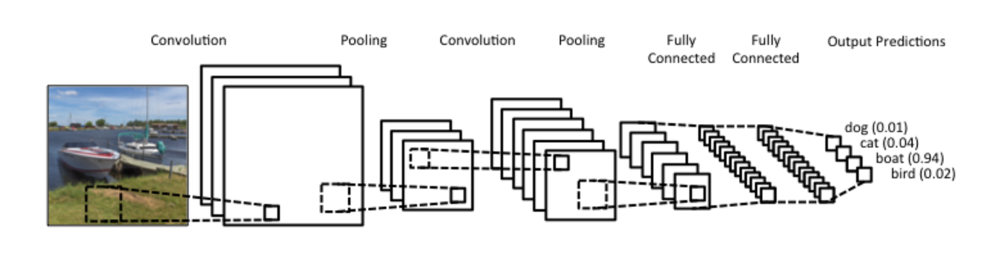

# Money-Tracker
## Description
```bash
Implementation of Convolutional neural network using Lenet architecture.
```

## Files Guide
#### pyimagesearch/lenet.py
```bash
- The Architecture of the CNN model.
- LeNet-5 CNN architecture is made up of 7 layers.
- The layer composition consists of: 
    3 convolutional layers,
    2 subsampling layers and
    2 fully connected layers.
```
#### NumbersModel, Numbers_train_Network.py, Plot.png
```bash
- "NumbersModel" -> pre-trained model for the "egyptian" serial numbers on banknotes.
- "Numbers_train_Network.py" -> The python script responsible for trainning the CNN 
- "Plot.png" contains the result of the training procedure.
```
#### Money_Recognition.py
```bash
- The Main Script, acting as the server side.
- When runs it connects automatically to "Firebase", 
    listens for any new data, 
    whenever a data is sent (from IOS app), 
    it recognizes the serial number and "POST" to firebase the result.
```
#### Results
```bash
- Contains a recorded video from the IOS app.
```
